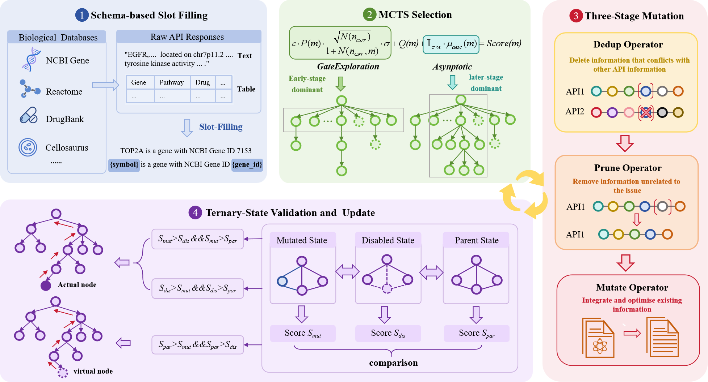

# VCAgent

<p align="left">
  <a href="https://www.python.org/">
    
  </a>
  <a href="https://docs.litellm.ai/">
    
  </a>
  <a href="https://doi.org/10.1145/3770855.3818989">
    
  </a>
</p>

This is the official implementation of **VCAgent: A Mutation-Guided Self-Reflective Agent Framework for Virtual Cell Modeling** (KDD 2026).



VCAgent is a self-evolving LLM agent framework for virtual cell modeling. It formulates biological knowledge integration as a sequential decision-making problem over tool use and context construction. The framework consists of two core components:

- **Schema-based Slot Filling**: Transforms raw API responses into compact, structured representations via cognitive templates, reducing noise and redundancy in biological context.
- **Mutation-Guided Monte Carlo Tree Search (MG-MCTS)**: An improved PUCT strategy with semantic priors and adaptive gating that efficiently navigates high-dimensional instruction spaces to evolve optimal biological context construction logic.

VCAgent integrates 10 biological databases (NCBI Gene, UniProt, Reactome, KEGG, Ensembl, Cellosaurus, CCLE, DepMap, PubChem, DrugBank) and optimizes both system prompts and API information slots through MCTS-guided reflective mutation.

## Installation

**Step 1.** Clone this repository.

```bash
git clone https://github.com/LZYBUPT/VCAgent.git
cd VCAgent
```

**Step 2.** Create a conda environment with Python 3.11 and install the package.

```bash
conda create -n vcagent python=3.11 -y
conda activate vcagent
pip install -e ".[full]"
pip install networkx
```

**Step 3.** Set your API key. VCAgent uses [LiteLLM](https://docs.litellm.ai/) as the LLM gateway, supporting OpenAI, DeepSeek, and other providers.

```bash
# For OpenAI
export OPENAI_API_KEY="your-openai-key"

# For DeepSeek
export OPENAI_API_KEY="your-deepseek-key"
export OPENAI_BASE_URL="https://api.deepseek.com/v1"
```

## Datasets

We evaluate VCAgent on the Tahoe 100M raw expression matrix across five representative cell lines (C32, HOP62, HepG2, Hs 766T, PANC-1) and 348 drug perturbation conditions. Each cell line has four data files under `data/<cell_line>/`:
- `DE_train.json` / `DE_test.json` — Differential Expression task
- `DIR_train.json` / `DIR_test.json` — Directional Change task

## Usage

### GEPA Optimization on DIR Task

```bash
python Main_DIR.py
```

This runs 100 iterations of MCTS-guided prompt optimization on the C32 DIR task. The optimized prompts (system prompt + 10 API information slots) are saved to `output/`.

### GEPA Optimization on DE Task

```bash
python Main_DE.py
```

This runs 50 iterations on the Hs 766T DE task.

### Evaluation on Test Set

```bash
# With API integration
python test/with_API/evaluate_testset_deepseek.py

# Without API (baseline)
python test/without_API/evaluate_testset_deepseek.py
```

### Customizing the LLM Backend

To change the backbone LLM, modify the `model` parameter in the main scripts:

```python
# In Main_DIR.py or Main_DE.py
custom_adapter = BioAPIAdapter(
    model="openai/deepseek-chat",      # DeepSeek
    # model="openai/gpt-4o",           # OpenAI GPT-4o
    api_client=api_client,
    enable_api_calls=True,
)
```

## Project Structure

```
VCAgent/
├── Main_DE.py              # Entry point: DE task optimization
├── Main_DIR.py             # Entry point: DIR task optimization
├── API_use.py              # API client
├── assets/                 # Figures
├── data/                   # Train/test datasets (5 cell lines)
├── output/                 # Optimization results (auto-generated)
├── test/                   # Evaluation scripts
│   ├── with_API/           # Test with API integration
│   └── without_API/        # Baseline test without API
├── Graph_API/              # API relationship graph generation
│   ├── config.py
│   ├── generate_api_relationship_graph.py
│   └── output/             # Pre-computed API similarities
└── src/gepa/               # GEPA framework (core library)
    ├── core/               # Engine, adapter, state, checkpoint
    ├── proposer/           # Reflective mutation, MCTS tree
    ├── strategies/         # Component selector, candidate selector
    ├── adapters/
    │   └── bio_api_adapter/  # Custom adapter for biological APIs
    └── utils/              # Stopping conditions, callbacks
```

## Citation

If you find this work useful, please cite:

```bibtex
@inproceedings{li2026vcagent,
  title={VCAgent: A Mutation-Guided Self-Reflective Agent Framework for Virtual Cell Modeling},
  author={Li, Zhiyun and Han, Rong and Wang, Xiaoyu and Zhang, Guofeng and Gao, Weixi and Su, Yusheng and Tian, Zihan and Liu, Xiaohong and Wang, Guangyu},
  booktitle={Proceedings of 32nd ACM SIGKDD Conference on Knowledge Discovery and Data Mining (KDD '26)},
  year={2026},
  publisher={ACM},
  doi={10.1145/3770855.3818989}
}
```
